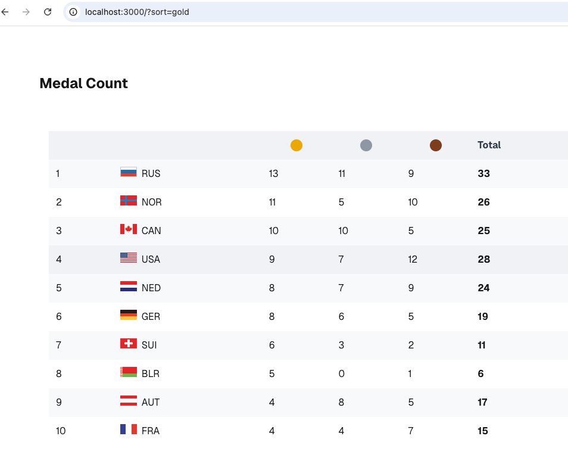

## medal-count-mini-app

Medal count app, that shows a olympic leaderboard

## Getting Started

First, run the development server:

```bash
npm run dev
# or
yarn dev
# or
pnpm dev
# or
bun dev
```

Open [http://localhost:3000](http://localhost:3000) with your browser to see the result.

## Features

- Displays the medal count of the top 10 countries
- Sorts based on gold, silver, bronze, total via url param sort and also by clicking table head
- Displays error and loading state based on API response


## Demo




